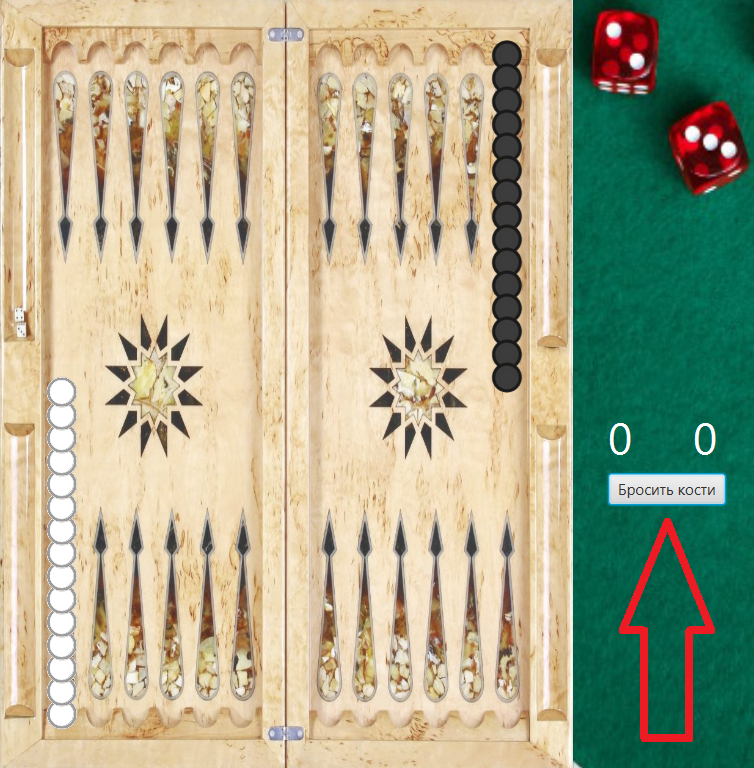
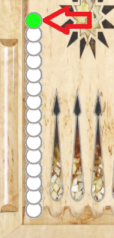
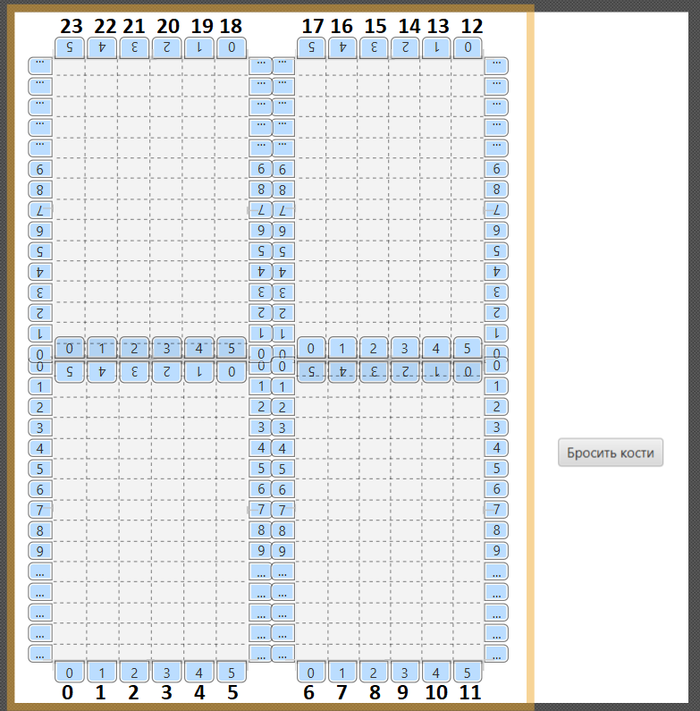

# Длинные нарды.
## Правила :  
1) Начальное расположение шашек на доске (позиция 0 и 12) называется «голова». Ход с этого положения называется «ход с головы». За один ход с головы можно взять только одну шашку. Но первый бросок с головы, в начале игры (партии) предоставляет игрокам исключение из вышеуказанного правила. Если одна шашка, которую только и можно снять с головы, не проходит, то можно снять вторую.
2) После броска игрок обязан передвинуть две свои шашки против часовой стрелки на столько лунок, сколько очков выпало на каждой из костей.Можно сделать два хода одной шашкой. Если на костях выпало одинаковое количество очков («дубль»), то бросок удваивается, то есть игрок должен сделать четыре движения шашками.
3) Если ход на выпавшее количество очков невозможен, эти очки «сгорают», но если возможность хода имеется, то игрок обязан, даже в ущерб себе, использовать все выпавшие очки.
4) Игрок должен пройти всеми шашками полный круг (против часовой стрелки), зайти ими в «дом» и «выбросить» их раньше, чем это сделает противник. «Домом» для каждого игрока считается последняя четверть игрового поля — «дом белых» (18-23) и «дом чёрных» (6-11). Термин «выбрасывать» означает делать шашкой такой ход, чтобы она оказывалась за пределами доски. «Выбрасывать» шашки можно только после того, как все шашки «пришли в дом».
5) Запрещено выставлять блок (заграждение; мост) из шести шашек, если впереди этого блока нет шашки соперника.
## Инструкция по геймплею
**После появления окна говорящего кто ходит первым, нужно нажать кнопку "Бросить кости". Выпавшие числа отобразятся под надписью "Кости".**
Пока что розыгрыш первого хода происходит невидимо для пользователя, но с добавлением ScoreBoard будет включено окно, где пользователи указывают имена, там будет и кнопка "Разыграть первый ход" 
  
**Далее на шашках которыми можно сходить появятся зелёные отметки**  
  
**Кликнув на шашку с зелёной отметкой вы выберете её для хода. Она будет выделена жёлтым, а возможные для неё ходы будут отмечены новыми зелёными отметками. А кликнув по выбранной шашке ещё раз вы можете отменить выбор**  
  
**Кликнув по зелёной отметке вы сделаете ход выбранной шашкой в данную позицию.**

### Прилагаю макет основной сцены
Сверху и снизу макета подписал условные позиции которые используются в коде

